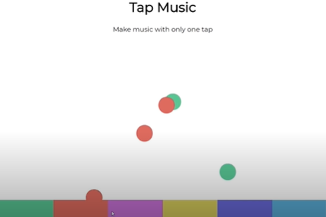

# Beat Maker in JavaScript
## Introduction
Tap Music is a JavaScript based web application which creates different sounds on clicking different colors on a bar placed at the end of the user interface(UI).

## Overview and Implementation Details
The structure of the page is established in HTML while CSS is used as usual for styling and animations. Finally vanilla
JavaScript is used for event listening and creating actions. In the CSS part, flex box and its properties are used to align the items and visuals while  `@keyframes` are used for creating animations. In the JavaScript part the mouse click event is listened and sound play along animation are triggered on the occurrence of the event. `document.querySelector()` is used for fetching HTML elements,`window.getComputedStyle(<element>).getPropertyValue('<property_name>')` are used to get the element's properties while `document.createElement()` is used to create element on the click event. Once the animation ends `<element_name>.parentElement.removeChild(this)` is used to delete the element to make the application scalable.
Download the application and run it to have fun.

